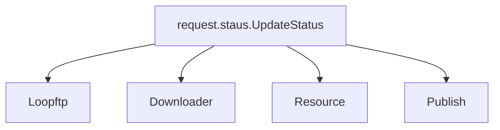

> ftp 检验器  loopftp.py
- 遍历ftp
- 判断json文件的值是否符合要求
- 插入一个公用的redis
- 请求php 判断分类是否存在


> ftp 下载器  downloader.py
- 下载文件
- 判断视频文件是否有效
- 删除ftp数据
- 视频转换， 并检测视频有效性， 删除多余的stream


> 资源处理 resource.py
- 处理数据， 成功就删除本地下载下来的数据
- 长图
- 横纵缩略图
- 缩略图
- 上传到resource
- 上传到php


> 发布处理  publish.py
- 处理数据， 成功就删除本地处理的数据
- 打水印
- 打水印的缩略图
- 上传到publish
- 上传到u5 php


> 代码类的架构图



# 部署
> 依赖
- ffmpeg 直接执行脚本安装 `sh installFFmpeg.sh`
- redis
- python >= 3.7
- python库 `pip3 install -r requirements.txt`
- scs `/bin/bash -c "$(curl -fsSL http://download.hyahm.com/scs.sh)"`

> 克隆配置文件到本地
```shell
git clone git@git.hyahm.com:root/hugo_scripts.git
```

> 配置文件`config.py`
```python
# -*- coding: UTF-8 -*-

CONFIG = {}

###############    loopftp 和 downloader需要使用  #############
# ftp 配置    loopftp 和 downloader需要使用
CONFIG["ftp_host"] = "127.0.0.1"
CONFIG["ftp_port"] = 21
CONFIG["ftp_user"] = "admin"
CONFIG["ftp_pwd"] = "poaihopdshogiho234"
CONFIG["ftp_dir"] = "/"  # FTP的路径
CONFIG["domain"] = ""
# 爬虫用户
CONFIG["spider"] = ["shenhe"]
# 单位Mb
CONFIG["video_size"] = 6144

############   resource.py 配置  ###############

# 资源机器的目录
CONFIG["resource_dir"] = "/home/hugo/"
# 爬虫用户
CONFIG["spider"] = ["shenhe"]


############   public.py 配置  ###############
CONFIG["date"] = "${YYYYMMDD}"
# 当指定机器后， 必定是某台机器上执行， 用来调试

# 队列长度， 建议等于机器开启publish.py 数量 * 2
CONFIG["cache"] = 1


##################  pulibc  ################################
CONFIG["debug"] = False
# 资源机器默认支持的变量


# 本地资源目录
CONFIG["local_dir"] = "/home/ftp_resource/"
# 远程ssh用户
CONFIG["ssh_user"] = "root"

# 资源地址

CONFIG["resource_domain"] = "http://23.225.165.34"
# 后端 接口
php_ip = "http://23.225.165.42:9999"


# Redis
CONFIG["ftp_redis"] = {
    "host": "23.225.165.34",
    "password": "hugonodahaiten",
    "port": 6379,
    "db": 10,
    "decode_responses": True
}

CONFIG["local_redis"] = {
    "host": "127.0.0.1",
    "password": "",
    "port": 6379,
    "db": 10,
    "decode_responses": True
}


CONFIG["scs"] = {
    "on": True,
    "domain": "https://127.0.0.1:11111"
}
```

> scs 配置文件`/etc/scs.yaml` 修改 字段下面的值
```yaml
log:
  path: log/scsd.log
  size: 0
  day: true
alert:
  telegram:
    server: http://47.244.47.130:8990/
    to:
    - -488457233
probe:
  mem: 60
  cpu: -1
  disk: 80
scripts:
- name: hugo_downloader
  dir: /home/app/hugo_scripts
  command: 'python3 downloader.py '
- name: hugo_pool
  dir: /home/app/hugo_scripts
  command: 'python3 pool.py '

- name: hugo_resource
  dir: /home/app/hugo_scripts
  command: 'python3 resource.py '

- name: hugo_publish
  dir: /home/app/hugo_scripts
  command: 'python3 publish.py '
  replicate: 2

- name: hugo_rotate
  dir: /home/app/hugo_scripts
  command: 'python3 rotate.py '
```

> 从此机器到下面的机器做ssh免密
```
23.224.69.186
23.225.8.194  
23.224.92.82
192.151.218.82  
192.168.100.20
23.225.8.210
23.224.224.34  
23.224.7.186  
192.168.100.80
23.224.1.106
```

> 加载一下配置文件
```
scsctl config reload
```

> 查看服务状态(全部running为正常)
```
scsctl status
```
